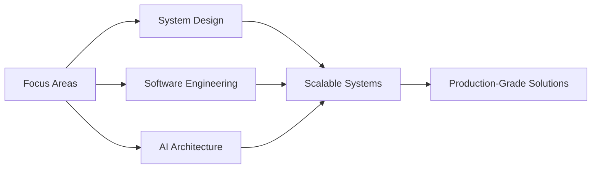

<div align="center">

# ✨ import PrathamJain from './awesome😎'

### Full-Stack Developer | AI Engineer | The "Go-to" Guy

<picture>
  <source media="(prefers-color-scheme: dark)" srcset="https://readme-typing-svg.demolab.com?font=Fira+Code&weight=600&size=28&pause=1000&color=3B82F6&center=true&vCenter=true&width=600&lines=MERN+Stack+Developer;AI+Engineer;Building+Scalable+Systems;Shipping+Products+That+Matter">
  
</picture>

</div>

---

## 🚀 About Me

I'm a **Full-Stack Developer & AI Engineer** from India, building products that solve real problems. From designing scalable architectures to implementing cutting-edge AI solutions, I focus on shipping code that works and systems that scale.

```javascript
const pratham = {
    role: "Full-Stack Developer & AI Engineer",
    expertise: [
        "GenAI",
        "RAG Systems",
        "LLMs",
        "Machine Learning",
        "System Design",
    ],
    techStack: {
        frontend: ["React", "Next.js", "TypeScript", "Tailwind CSS"],
        backend: ["Node.js", "Express", "MongoDB", "PostgreSQL"],
        mobile: ["React Native", "Flutter"],
        ai_ml: ["LangChain", "RAG", "TensorFlow", "Scikit-learn", "OpenAI API"],
        tools: ["Docker", "Git", "AWS", "Kubernetes", "Postman"],
    },
    currentlyLearning: "System Design & Software Engineering at Scale",
    workingOn: "Building production-ready AI applications",
    askMeAbout: [
        "MERN Stack",
        "App Development",
        "GenAI",
        "System Design",
        "Scalability",
    ],
    philosophy: "Ship fast, iterate faster 🚀",
};
```

---

## 💼 What I Do

<table>
<tr>
<td width="50%">

### 🎨 Frontend Development

-   Building responsive, pixel-perfect UIs
-   React, Next.js, TypeScript
-   Modern CSS frameworks (Tailwind, Bootstrap)
-   State management (Redux, Context API)

</td>
<td width="50%">

### ⚙️ Backend Development

-   RESTful API design & development
-   Database design (MongoDB, PostgreSQL, MySQL)
-   Authentication & Authorization
-   Cloud deployment (AWS, Heroku)

</td>
</tr>
<tr>
<td width="50%">

### 📱 Mobile Development

-   Cross-platform app development
-   React Native & Flutter
-   Native-like performance
-   App store deployment

</td>
<td width="50%">

### 🤖 AI & Machine Learning

-   Production-ready AI applications
-   RAG (Retrieval-Augmented Generation)
-   LLM integration & fine-tuning
-   ML model deployment

</td>
</tr>
</table>

---

## 🛠️ Tech Arsenal

<div align="center">

### Languages & Frameworks


### Databases & Cloud


### AI & ML


### Tools & Others


</div>

---

## 📊 GitHub Analytics

<div align="center">
<!-- <a href="https://github.com/pratham27-pro">
  
  
</a>
</div> -->

<div align="center">
  
</div>

<!-- <div align="center">
  
</div> -->

---

## 🎯 Current Focus



<div align="center">

**🔥 Deep diving into:** Distributed Systems • Software Engineering Principles • Production AI Deployment

**🎯 Mission:** Building systems that scale, products that ship

</div>

---

## 🌟 Featured Projects

<div align="center">

### 💼 Check out my complete portfolio for all my projects!

[](https://pratham-jain.vercel.app/)

</div>

---

## 📈 Contribution Graph

<div align="center">

<picture>
  <source media="(prefers-color-scheme: dark)" srcset="https://github-readme-activity-graph.vercel.app/graph?username=pratham27-pro&theme=tokyo-night&hide_border=true&bg_color=0d1117&cache_seconds=86400">
  
</picture>

</div>

---

## 🤝 Let's Connect!

<div align="center">

I'm always excited to collaborate on interesting projects and connect with fellow developers!

[](https://linkedin.com/in/pratham-jain-46645b325/)
[](https://www.leetcode.com/u/mr-pratham_27/)
[](https://pratham-jain.vercel.app/)

### 💻 Quick Connect

```bash
npx pratham_jain
```

</div>

---

<div align="center">

### 💡 "Talk is cheap. Show me the code." - Linus Torvalds


**Made with 💙 by [Pratham Jain](https://github.com/pratham27-pro)**

</div>

---

<div align="center">

<picture>
  <source media="(prefers-color-scheme: dark)" srcset="https://capsule-render.vercel.app/api?type=waving&color=gradient&customColorList=6,11,20&height=100&section=footer&animation=twinkling">
  
</picture>

</div>
